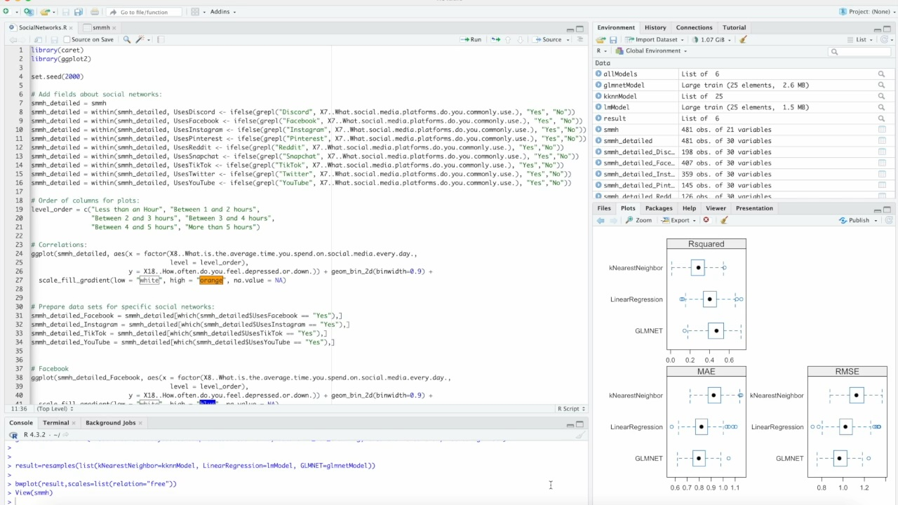
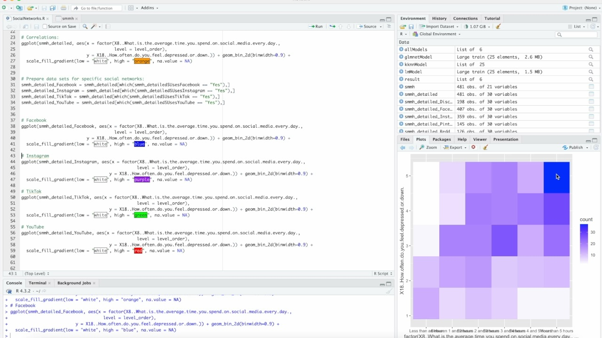

# Mental Health Risk Predictor

**Course Project for Stanford Continuing Studies – Introduction to Applied AI**

## Project Overview

This project explores the relationship between social media usage patterns and mental health symptoms using machine learning techniques.

Using survey data on social media habits and self-reported mental health indicators, I trained and evaluated several models to predict mental health risk based on user behavior.

## Approach

### Data Preparation

- Cleaned and transformed raw survey data.
- Handled missing values and encoded categorical variables.

### Modeling

Trained and compared the following machine learning models:

- k-Nearest Neighbors (k-NN)
- Linear Regression
- Elastic Net Regression

### Evaluation

- Evaluated model performance using standard regression metrics (e.g., RMSE, R²).
- Compared models to select the most effective predictor.

### Visualization

- Created visualizations with **ggplot2** to explore feature relationships and highlight trends in the data.

#### Example: Model Performance Comparison

#### Example: Social Media Usage vs. Depression Frequency (Heatmap)

## Technologies Used

- R  
- Caret  
- ggplot2  

## Demo Video

[Watch the demo on YouTube](https://www.youtube.com/watch?v=eKcXfV0kv4M)

## Disclaimer

This project was created for educational purposes only and is not intended for clinical use.
